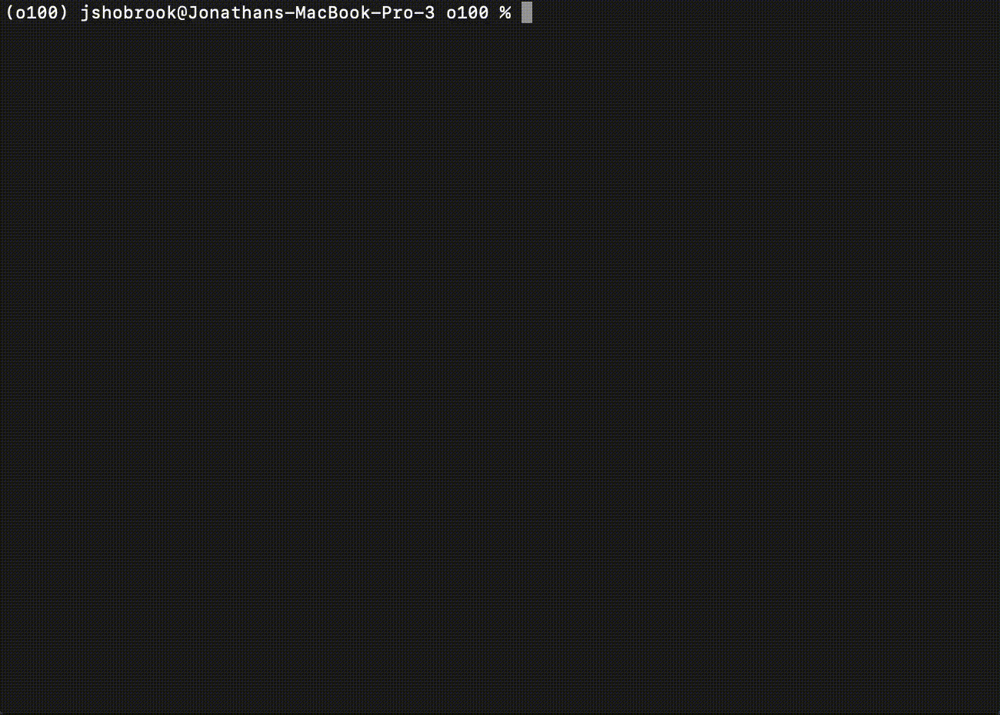

# promptimal

**CLI for quickly improving your AI prompts. No dataset needed.**

Just submit your prompt and a description of what you want to improve. Promptimal will then use a genetic algorithm to iteratively refine the prompt until it's better than the original. An LLM evaluates the modified prompts to guide the process, but you can also define your own evaluation function.



## Installation

```bash
> pipx install promptimal
```

Once installed, make sure you have your OpenAI API key added to your environment:

```bash
> export OPENAI_API_KEY="..."
```

## Quickstart

Open the tool from your terminal:

```bash
> promptimal
```

You'll be asked to input your initial prompt and what you want to improve. Alternatively, you can specify these inputs as command-line arguments:

```bash
> promptimal \
    --prompt "You will be provided with a piece of code, and your task is to explain it in a concise way." \
    --improve "Summaries need to include less code references and be more high-level."
```

Once you're done, a UI will open in your terminal for monitoring the optimization process:


## Advanced usage

### Hyperparameters

You can control the optimization parameters by passing additional command-line arguments:

```bash
> promptimal --num_iters=10 --num_samples=20 --threshold=0.7
```

1. `num_iters`: Number of iterations to run the optimization loop for. Equivalent to the number of "generations" in an evolutionary algorithm.
2. `num_samples`: Number of candidate prompts to generate in each iteration. Equivalent to the "population size" in an evolutionary algorithm.
3. `threshold`: Termination threshold for the loop. If a candidate prompt gets a score higher than this threshold, the optimization loop will stop. Default is 1.0.

### Custom evaluators

By default, promptimal uses an LLM-as-judge approach (with self-consistency) to evaluate prompt candidates. But to boost performance, you may want to evaluate prompts against a dataset or use some other evaluation technique. To do this, first create a Python file called `evaluator.py`. Then copy/paste the code below into that file and define your own evaluation function:

```python
import argparse

def evaluator(prompt: str) -> float:
    # Your code goes here
    # Must return value between 0 and 1

def main():
    parser = argparse.ArgumentParser()
    parser.add_argument("--prompt", required=True, type=str)
    args = parser.parse_args()

    score = evaluator(args.prompt)
    print(score)

if __name__ == "__main__":
    main()
```

Once finished, specify the path to `evaluator.py` when you run promptimal:

```bash
> promptimal --evaluator="path/to/evaluator.py"
```

This file will effectively serve as a script that promptimal uses to evaluate prompts.

### Custom OpenAI Base URL and Model Name

You can also specify a custom OpenAI base URL and model name using the following command-line arguments:

```bash
> promptimal --openai_base_url="https://api.openai.com/v1" --openai_model_name="gpt-4"
```

This allows you to use different OpenAI endpoints and models as needed.

## Roadmap

1. Support for other LLM providers, like Anthropic, Groq, etc. And ollama for local models.
2. Evolve not only the prompts, but the meta-prompts (based on the [PromptBreeder paper](https://arxiv.org/pdf/2309.16797)).
3. Pre-define some mutation operators.
4. Generate synthetic tests as part of the evaluation process.
